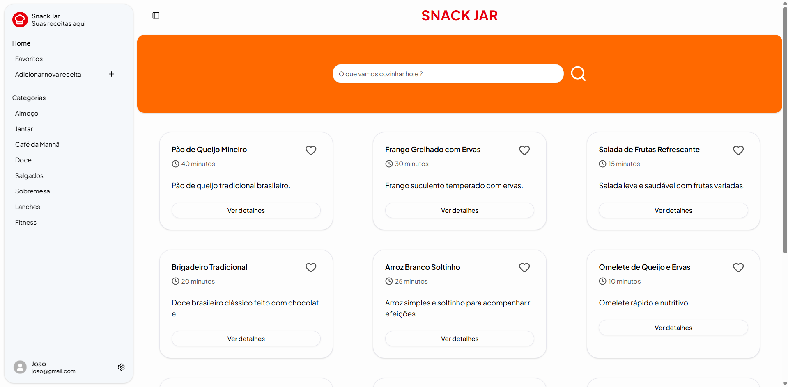

# 🧑‍🍳 Snack Jar

Interface web da aplicação Snack Jar, responsável pela interação do usuário com o sistema de gerenciamento de receitas.

O frontend consome a API desenvolvida em Node.js + TypeScript, responsável pela autenticação, gerenciamento de receitas e persistência de dados.

### 🔗 Backend API
https://github.com/GuilhermeOliveiraAgenor/snackjar-backend


## 📌 About

**Snack Jar** é uma **aplicação web** que funciona como um **livro de receitas digital**, permitindo que usuários armazenem e organizem suas **receitas pessoais** de forma **segura**.

A interface foi desenvolvida utilizando **Next.js** e **React**, priorizando **performance** e **escalabilidade**. O sistema oferece suporte para **autenticação tradicional** e **login social com Google**, além de funcionalidades completas para **gerenciamento de receitas**, **ingredientes** e **etapas de preparo**.

A aplicação utiliza **React Query** para **gerenciamento de estado assíncrono** e **cache de dados da API**, **TailwindCSS** e **shadcn/ui** para construção da interface e **React Hook Form + Zod** para **validação de formulários**.

## 📷 Interface

Tela principal da aplicação onde o usuário pode visualizar, pesquisar e acessar suas receitas cadastradas.

<p align="center">
  
</p>


## 🚀 Features

- Cadastro e autenticação de usuários
- Login social com Google OAuth
- Cadastro e gerenciamento de receitas
- Sistema de favoritos
- Pesquisa e filtro de receitas
- Gerenciamento de ingredientes e etapas

## 🛠️ Tech Stack

- React
- Next.js
- TypeScript
- TailwindCSS
- shadcn/ui
- React Query
- Axios
- Zod
- React Hook Form
- Google OAuth

## 🏗️ Estrutura do projeto

A estrutura do projeto é organizada em **módulos de funcionalidades** e **componentes reutilizáveis**, promovendo melhor organização do código e maior facilidade na evolução da aplicação.

```text
src
├─ app
├─ components
├─ hooks
├─ lib
├─ modules
│  └─ class
│     ├─ components
│     ├─ hooks
│     ├─ schemas
│     ├─ services
│     └─ types
└─ styles
```

### Descrição das principais pastas

- app → rotas e páginas da aplicação utilizando o App Router do Next.js
- components → componentes reutilizáveis da interface
- hooks → hooks globais da aplicação
- lib → utilitários e configurações compartilhadas
- modules → organização das funcionalidades do sistema

## ▶️ Run

### 1️⃣ Clone o repositório
```
git clone https://github.com/GuilhermeOliveiraAgenor/snackjar-frontend.git
cd snackjar-frontend
```

### 2️⃣ Instalar dependências
```
npm install
```

### 3️⃣ Configurar variáveis de ambiente
Utilize o `.env.example` como base para configurar o arquivo `.env`.
```
cp .env.example .env
```

### 4️⃣ Iniciar aplicação

```
npm run dev
```


